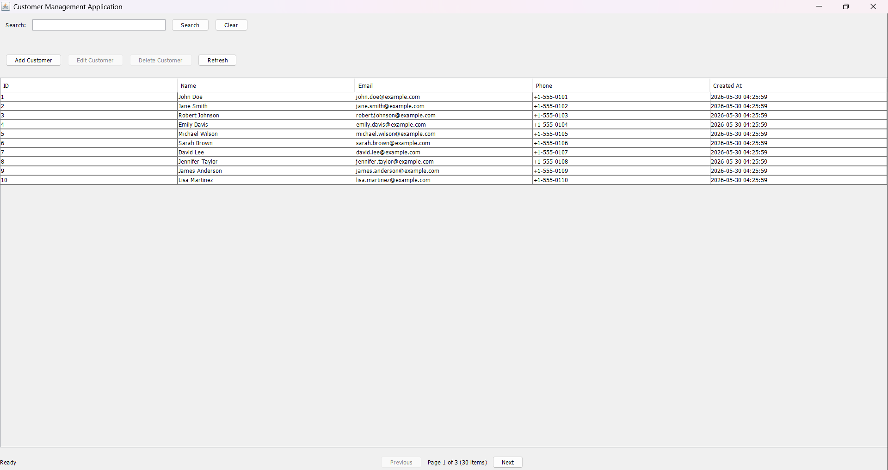
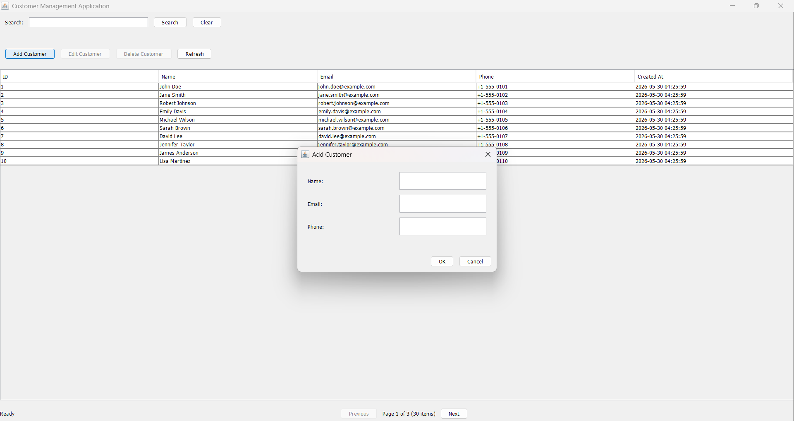
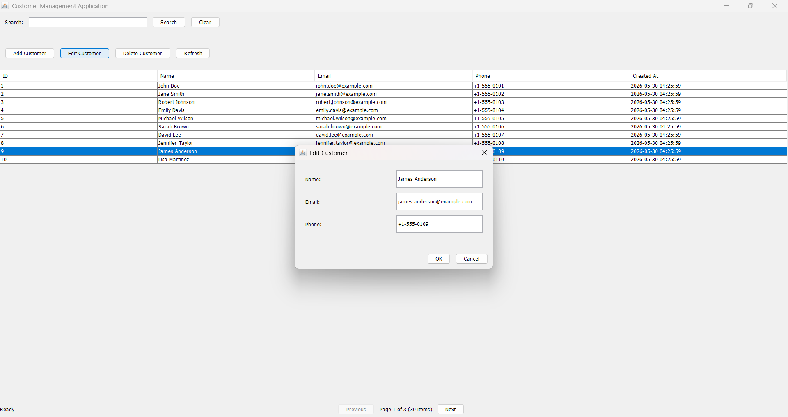
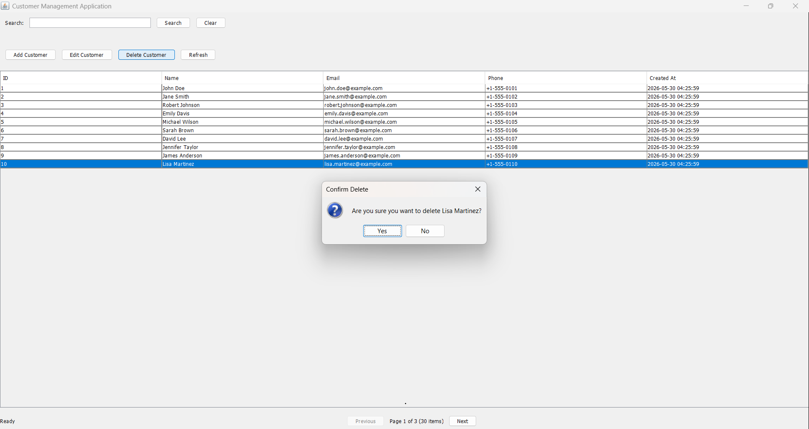
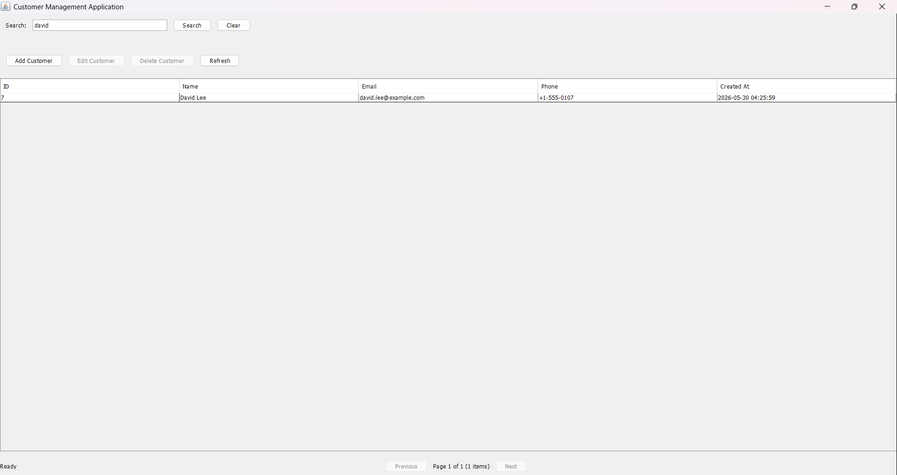
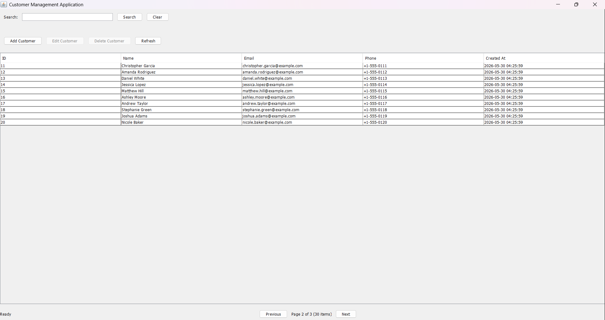
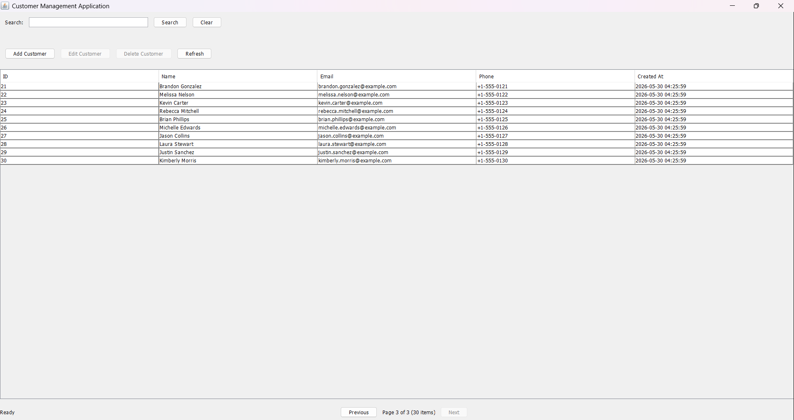

# Customer Management Application

A full-stack customer management system consisting of a Spring Boot REST API backend and a Swing desktop client application.

## Project Structure

The project is divided into two main parts:

```
Developer_Test_Task_spring_swing/
├── backend/                    # Spring Boot REST API
│   ├── src/
│   │   ├── main/
│   │   │   ├── java/
│   │   │   │   └── com/customerapp/
│   │   │   │       ├── CustomerBackendApplication.java
│   │   │   │       ├── controller/
│   │   │   │       │   └── CustomerController.java
│   │   │   │       ├── service/
│   │   │   │       │   └── CustomerService.java
│   │   │   │       ├── repository/
│   │   │   │       │   └── CustomerRepository.java
│   │   │   │       └── model/
│   │   │   │           └── Customer.java
│   │   │   └── resources/
│   │   │       └── application.properties
│   │   └── sql/
│   │       └── schema.sql
│   └── pom.xml
└── desktop/                    # Swing Desktop Application
    ├── src/
    │   └── main/
    │       └── java/
    │           └── com/customerapp/desktop/
    │               ├── CustomerDesktopApp.java
    │               ├── api/
    │               │   └── CustomerApiClient.java
    │               ├── model/
    │               │   └── Customer.java
    │               └── ui/
    │                   ├── MainFrame.java
    │                   └── CustomerDialog.java
    └── pom.xml
```

### Backend (Spring Boot)
The backend is a Spring Boot application that provides REST API endpoints for managing customers. It handles:
- Database operations using Spring Data JPA
- RESTful API with proper HTTP methods and status codes
- Input validation
- Business logic

### Desktop Client (Swing)
The desktop application is a Java Swing application that:
- Consumes the REST API for all data operations
- Provides a user interface for CRUD operations
- Has no direct database connection
- Handles API errors gracefully

## Prerequisites

- Java 17 or higher
- Maven 3.6 or higher
- (Optional) MySQL, MS SQL Server, or SQLite if you want to use a persistent database instead of H2

## Setup Instructions

### 1. Start the Spring Boot Backend

Navigate to the backend directory:

```bash
cd backend
```

Build the project:

```bash
mvn clean install
```

Run the application:

```bash
mvn spring-boot:run
```

Or run the JAR file directly:

```bash
java -jar target/customer-backend-1.0.0.jar
```

The backend will start on `http://localhost:8080`

**Note:** By default, the application uses an in-memory H2 database. The database schema is automatically created by Hibernate. If you want to use a different database, modify the `application.properties` file.

#### Database Configuration

To use a different database, update `backend/src/main/resources/application.properties`:

**For MySQL:**
```properties
spring.datasource.url=jdbc:mysql://localhost:3306/customerdb
spring.datasource.username=your_username
spring.datasource.password=your_password
spring.jpa.database-platform=org.hibernate.dialect.MySQLDialect
```

**For MS SQL Server:**
```properties
spring.datasource.url=jdbc:sqlserver://localhost:1433;databaseName=customerdb
spring.datasource.username=your_username
spring.datasource.password=your_password
spring.jpa.database-platform=org.hibernate.dialect.SQLServerDialect
```

**For SQLite:**
```properties
spring.datasource.url=jdbc:sqlite:customer.db
spring.jpa.database-platform=org.hibernate.dialect.SQLiteDialect
spring.jpa.hibernate.ddl-auto=update
```

Run the appropriate SQL script from `backend/sql/schema.sql` to create the table.

### 2. Start the Desktop Application

Open a new terminal and navigate to the desktop directory:

```bash
cd desktop
```

Build the project:

```bash
mvn clean package
```

Run the application:

```bash
java -jar target/customer-desktop-1.0.0.jar
```

**Note:** The Maven Shade Plugin is used to create a fat JAR with all dependencies included. If you encounter class not found errors, ensure you've rebuilt the project after any dependency changes.

Or run directly from Maven:

```bash
mvn exec:java -Dexec.mainClass="com.customerapp.desktop.CustomerDesktopApp"
```

Or run from your IDE (NetBeans, IntelliJ IDEA, Eclipse) by running the `CustomerDesktopApp` class.

## API Endpoints

The backend exposes the following REST endpoints:

| Method | Endpoint | Description |
|--------|----------|-------------|
| GET | `/customers` | Retrieve all customers |
| GET | `/customers/{id}` | Retrieve a single customer by ID |
| POST | `/customers` | Create a new customer |
| PUT | `/customers/{id}` | Update an existing customer |
| DELETE | `/customers/{id}` | Delete a customer |

### Example API Usage

**Get all customers:**
```bash
curl http://localhost:8080/customers
```

**Get customer by ID:**
```bash
curl http://localhost:8080/customers/1
```

**Create a customer:**
```bash
curl -X POST http://localhost:8080/customers \
  -H "Content-Type: application/json" \
  -d '{"name":"John Doe","email":"john@test.com","phone":"+123456789"}'
```

**Update a customer:**
```bash
curl -X PUT http://localhost:8080/customers/1 \
  -H "Content-Type: application/json" \
  -d '{"name":"John Smith","email":"john.smith@test.com","phone":"+987654321"}'
```

**Delete a customer:**
```bash
curl -X DELETE http://localhost:8080/customers/1
```

## Postman Collection

A Postman collection is included for easy testing of all API endpoints. The collection file is located at:

```
Customer_API_Collection.postman_collection.json
```

### Importing the Collection

1. Open Postman
2. Click on "Import" in the top left corner
3. Select "Upload Files" and choose `Customer_API_Collection.postman_collection.json`
4. The collection will be imported and appear in your Collections sidebar

### Collection Contents

The collection includes all CRUD endpoints with:

- **GET /customers** - Retrieve all customers
- **GET /customers/:id** - Retrieve customer by ID
- **POST /customers** - Create new customer
- **PUT /customers/:id** - Update customer
- **DELETE /customers/:id** - Delete customer

Each endpoint includes:
- Pre-configured HTTP methods and headers
- Request body examples with JSON data
- Example responses for success and error cases
- Variable parameters for dynamic IDs
- Descriptions for each operation

### Using the Collection

1. Ensure the Spring Boot backend is running on `http://localhost:8080`
2. Open the imported collection in Postman
3. Click on any request to send it to the API
4. For requests with `:id` variables, replace the value with an actual customer ID
5. View the response in the Postman response panel

## Desktop Application Features

The desktop application provides:

- **Customer List View**: Displays all customers in a table format
- **Add Customer**: Click "Add Customer" button to create a new customer
- **Edit Customer**: Select a customer and click "Edit Customer" or double-click to edit
- **Delete Customer**: Select a customer and click "Delete Customer" with confirmation
- **Refresh**: Click "Refresh" to reload the customer list from the API
- **Loading Indicators**: Progress bar shows during API calls
- **Error Handling**: Graceful error messages for API failures
- **Input Validation**: Client-side validation for email format and required fields

## Communication Between Desktop and Backend

The desktop application communicates with the backend using HTTP requests:

1. The desktop app uses `HttpURLConnection` to make HTTP requests to the REST API
2. JSON data is serialized/deserialized using the Gson library
3. All CRUD operations go through the API endpoints
4. The desktop app has no direct database access
5. API errors are caught and displayed to the user with appropriate messages

## Data Model

### Customer Entity

| Field | Type | Description |
|-------|------|-------------|
| id | Integer | Primary key (auto-increment) |
| name | String | Customer full name (max 100 characters) |
| email | String | Email address (unique, max 100 characters) |
| phone | String | Phone number (max 50 characters) |
| createdAt | LocalDateTime | Timestamp of record creation |

## Running in NetBeans

### Backend
1. Open NetBeans
2. File → Open Project → Select the `backend` directory
3. Right-click on the project → Run

### Desktop Application
1. File → Open Project → Select the `desktop` directory
2. Right-click on the project → Run
3. Or right-click on `CustomerDesktopApp.java` → Run File

## Troubleshooting

**Backend won't start:**
- Ensure Java 17+ is installed
- Check if port 8080 is already in use
- Verify Maven dependencies are downloaded

**Desktop app can't connect to API:**
- Ensure the backend is running on `http://localhost:8080`
- Check firewall settings
- Verify the API URL in `CustomerApiClient.java` matches your backend URL

**Database errors:**
- For H2: No setup needed (in-memory)
- For other databases: Ensure the database server is running and credentials are correct
- Run the appropriate SQL script from `backend/sql/schema.sql`

## Bonus Features Implemented

- ✅ Input validation (both client-side and server-side)
- ✅ Proper HTTP status codes (200, 201, 204, 404, 409, 500)
- ✅ Loading indicators in the desktop UI during API calls
- ✅ Graceful error handling with user-friendly messages
- ✅ Double-click to edit functionality
- ✅ Email uniqueness validation
- ✅ Cross-origin support (CORS) for API
- ✅ Customer search/filter functionality (searches name, email, phone)
- ✅ Pagination support on API endpoints
- ✅ API Key authentication for security

## API Security

The API is protected with API Key authentication. All requests must include the `X-API-Key` header with the correct value.

**Default API Key:** `secret-api-key-12345`

You can configure the API key in `backend/src/main/resources/application.properties`:

```properties
api.key=your-secret-key-here
```

**Example request with API Key:**
```bash
curl -H "X-API-Key: secret-api-key-12345" http://localhost:8080/customers
```

## Search and Pagination

The GET /customers endpoint now supports search and pagination:

**Parameters:**
- `search` (optional): Search term to filter customers by name, email, or phone
- `page` (optional): Page number (default: 0)
- `size` (optional): Number of items per page (default: 10)
- `sortBy` (optional): Field to sort by (default: id)
- `sortDir` (optional): Sort direction - asc or desc (default: asc)

**Example requests:**
```bash
# Search customers
curl -H "X-API-Key: secret-api-key-12345" "http://localhost:8080/customers?search=John"

# Get paginated results
curl -H "X-API-Key: secret-api-key-12345" "http://localhost:8080/customers?page=0&size=5"

# Search with pagination
curl -H "X-API-Key: secret-api-key-12345" "http://localhost:8080/customers?search=Smith&page=0&size=10"
```

**Response format:**
```json
{
  "content": [...],
  "currentPage": 0,
  "totalItems": 10,
  "totalPages": 2,
  "size": 10
}
```

## Desktop Application Search

The desktop application now includes a search field:
- Enter a search term and click "Search" to filter customers
- Click "Clear" to remove the search filter and show all customers
- Search filters by name, email, or phone number
- The search is preserved when adding, editing, or deleting customers

## Screenshots

### Main View


### Add Customer


### Update Customer


### Delete Customer


### Search/Filter


### Pagination - Page 1


### Pagination - Page 2


## License

This project is created for demonstration purposes.
